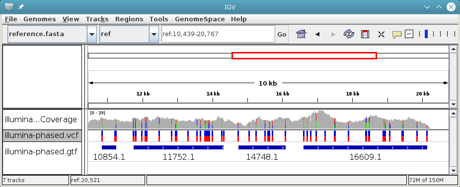
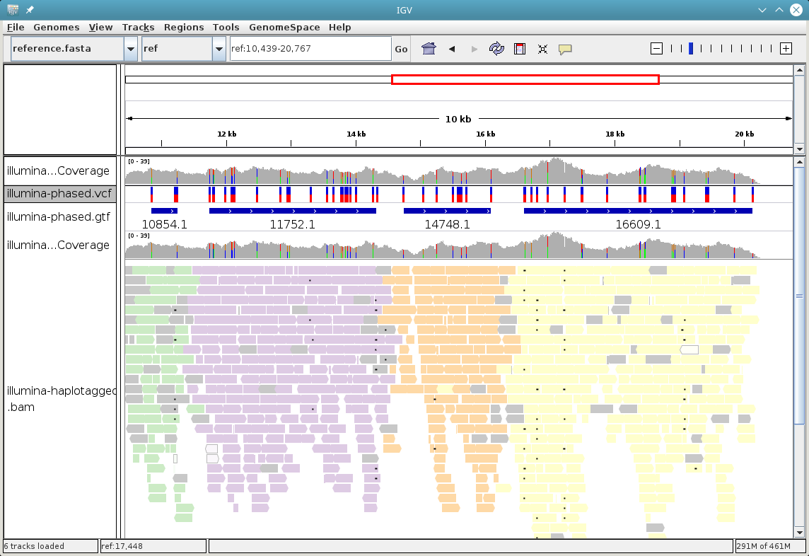
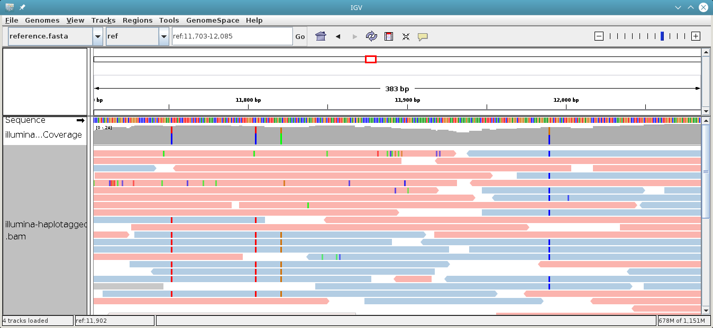

.. _user-guide:

==========
User guide
==========

WhatsHap is a read-based phasing tool. In the typical case, it expects
1) a VCF file with variants of an individual and 2) a BAM file with sequencing
reads from that same individual. WhatsHap uses the sequencing reads to
reconstruct the haplotypes and then writes out the input VCF augmented with
phasing information.

The basic command-line for running WhatsHap is this::

    whatshap phase -o phased.vcf input.vcf input.bam

The reads used for variant calling (to create the input VCF) do not
need to be the same as the ones that are used for phasing. We
recommend that high-quality short reads are used for variant calling and
that the phasing is then done with long reads, see :ref:`the recommended
workflow <recommended-workflow>`.

If the input VCF is a multi-sample VCF, WhatsHap will haplotype all
samples individually. For this, the input must contain reads from all
samples.

:ref:`Multiple BAM files can be provided <multiple-bam-files>`, even from different
technologies.

If you want to phase samples of individuals that are related, you can use
:ref:`pedigree phasing <phasing-pedigrees>` mode to improve results.
In this mode, WhatsHap is no longer purely a read-based phasing tool.

With error-prone reads (PacBio, Nanopore), we strongly recommend that you
enable re-alignment mode by providing a reference in FASTA format::

    whatshap phase --reference ref.fasta -o phased.vcf input.vcf input.bam

You can also phase indels by adding the option ``--indels``.

WhatsHap adds the phasing information to the input VCF file and writes it to
the output VCF file. :ref:`See below to understand how phasing information
is represented <phasing_in_vcfs>`.
The VCF file can also be gzip-compressed.

Features and limitations
========================

WhatsHap supports phasing of variants in diploid genomes.

Supported variant types are SNVs (single-nucleotide variants), insertions,
deletions, MNPs (multiple adjacent SNVs) and “complex” variants. Complex
variants are those that do not fall in any of the other categories, but
are not structural variants. An example is the variant TGCA → AAC.
Structural variants are not phased.

If no reference sequence is provided (using ``--reference``), only
SNVs, insertions and deletions can be phased.

All variants in the input VCF that are marked as being heterozygous
(genotype 0/1) and that have appropriate coverage are used as input for the core
phasing algorithm. If the algorithm could determine how the variant should be
phased, that information will be added to the variant in the output VCF.

Variants can be left unphased for two reasons: Either the variant type is
not supported or the phasing algorithm could not make a phasing decision.
In both cases, the information from the input VCF is simply copied to output
VCF unchanged.

Subcommands
===========

WhatsHap comes with the following subcommands.

========== ===================================================
Subcommand Description
========== ===================================================
phase      Phase variants in a VCF with the WhatsHap algorithm
stats      Print phasing statistics
compare    Compare two or more phasings
hapcut2vcf Convert hapCUT output format to VCF
unphase    Remove phasing information from a VCF file
haplotag   Tag reads by haplotype
haplofasta Write haplotypes in FASTA format from a phased VCF
genotype   Genotype variants
========== ===================================================

Not all are fully documented in this manual, yet. To get help for a
subcommand named ``SUBCOMMAND``, run ::

    whatshap SUBCOMMAND --help

.. _recommended-workflow:

Recommended workflow
====================

Best phasing results are obtained if you sequence your sample(s) on both PacBio
and Illumina: Illumina for high-quality variant calls and PacBio for its long
reads.

1. Map your reads to the reference, making sure that you assign each read to a
read group (the "@RG" header line in the BAM file). WhatsHap supports VCF files
with multiple samples and in order to determine which reads belong to which
sample, it uses the 'sample name' (SM) of the read group. If you have a single
sample only and no or incorrect read group headers, you can run WhatsHap with
``--ignore-read-groups`` instead.

2. Call variants in your sample(s) using the most accurate reads you have. These
will typically be Illumina reads, resulting in a a set of variant calls you can
be reasonably confident in. If you do not know which variant caller to use, yet,
we recommend FreeBayes, which is fast, Open Source and easy to use. In any case,
you will need a standard VCF file as input for WhatsHap in the next step.

3. Run WhatsHap with the VCF file of high-confidence variant calls (obtained in
the previous step) and with the *longest* reads you have. These will typically
be PacBio reads. Phasing works best with long reads, but WhatsHap can use any
read that covers at least two heterozygous variant calls, so even paired-end or
mate-pair reads are somewhat helpful. If you have multiple sets of reads, you
can combine them by providing multiple BAM files on the command line.

.. _input-data-requirements:

Input data requirements
=======================

WhatsHap needs correct metadata in the VCF and the BAM input files so that it can
figure out which read belongs to which sample. As an example, assume you give
WhatsHap a VCF file that starts like this::

    ##fileformat=VCFv4.1
    #CHROM  POS  ID  REF  ALT  QUAL   FILTER  INFO FORMAT  SampleA  SampleB
    chr1    100  .   A    T    50.0   .       .    GT      0/1      0/1
    ...

WhatsHap sees that there are two samples in it named “SampleA” and “SampleB”
and expects to find the reads for these samples somewhere in the BAM file (or
files) that you provide. For that to happen, all reads belonging to a sample
must have the ``RG`` tag, and at the same time, the read group must occur in the
header of the SAM/BAM file and have the correct sample name. In this example, a
header might look like this::

	@HD     VN:1.4  SO:coordinate
	@SQ     SN:...  LN:...
	...
	@RG   ID:1  SM:SampleA
	@RG   ID:2  SM:SampleB

The ``@RG`` header line will often contain more fields, such as ``PL`` for
the platform and ``LB`` for the library name. WhatsHap only uses the ``SM``
attribute.

With the above header, the individual alignments in the file will be tagged with
a read group of ``1`` or ``2``. For example, an alignment in the BAM file that
comes from SampleA would be tagged with ``RG:Z:1``. This is also described in
the `SAM/BAM specification <https://samtools.github.io/hts-specs/>`_.

It is perfectly fine to have multiple read groups for a single sample::

	@RG   ID:1a  SM:SampleA
	@RG   ID:1b  SM:SampleA
	@RG   ID:2   SM:SampleB

What to do when the metadata is not correct
-------------------------------------------

If WhatsHap complains that it cannot find the reads for a sample, then chances
are that the metadata in the BAM and/or VCF file are incorrect. You have the
following options:

* Edit the sample names in the VCF header.
* Set the correct read group info in the BAM file, for example with the Picard
  tool AddOrReplaceReadGroups.
* Re-map the reads and pass the correct metadata-setting options to your mapping
  tool.
* Use the ``--ignore-read-groups`` option of WhatsHap. In this case, WhatsHap
  ignores all read group metadata in the BAM input file(s) and assumes that all
  reads come from the sample that you want to phase. In this mode, you can
  only phase a single sample at a time. If the input VCF file contains more than
  one sample, you need to specify which one to phase by using
  ``--sample=The_Sample_Name``.

.. _multiple-bam-files:

Using multiple input BAM files
------------------------------

WhatsHap supports reading from multiple BAM files. Just provide all BAM files
you want to use on the command-line. All the reads across all BAMs that
belong to a specific sample are used to phase that sample. This can be used to
combine reads from multiple technologies. For example, if you have Nanopore
reads in one file and PacBio reads in another file, you can run the
phasing like this::

    whatshap phase -o phased.vcf input.vcf nanopore.bam pacbio.bam

You need to make sure that read group information
:ref:`is accurate in all files <input-data-requirements>`.

.. _vcfs-as-reads:

Using a phased VCF instead of a BAM file
----------------------------------------

It is possible to provide a phased VCF file instead of a BAM file. WhatsHap will
then treat the haplotype blocks (:ref:`phase sets <phase-sets>`) it describes as
"reads". For example, if the phased VCF contains only chromosome-sized
haplotypes, then each chromosome would give rise to two such "reads".
These reads are then used as any other read in the phasing algorithm,
that is, they are combined with the normal sequencing reads and the best
solution taking all reads into account is computed.

.. _phasing_in_vcfs:

Representation of phasing information in VCFs
=============================================

WhatsHap supports two ways in which it can store phasing information in a VCF
file: The standards-compliant ``PS`` tag and the ``HP`` tag used by GATK’s
ReadBackedPhasing tool. When you run ``whatshap phase``, you can select which
format is used by setting ``--tag=PS`` or ``--tag=HP``.

We will use a small VCF file as an example in the following. Unphased, it
looks like this::

    ##fileformat=VCFv4.1
    #CHROM  POS  ID  REF  ALT  QUAL   FILTER  INFO FORMAT  sample1  sample2
    chr1    100  .   A    T    50.0   .       .    GT      0/1      0/1
    chr1    150  .   C    G    50.0   .       .    GT      0/1      1/1
    chr1    300  .   G    T    50.0   .       .    GT      0/1      0/1
    chr1    350  .   T    A    50.0   .       .    GT      0/1      0/1
    chr1    500  .   A    G    50.0   .       .    GT      0/1      1/1

Note that sample 1 is heterozygous at all shown loci (expressed with
``0/1`` in the ``GT`` field).

Phasing represented by pipe (``|``) notation
--------------------------------------------

The ``GT`` fields can be phased by ordering the alleles by haplotype and
separating them with a pipe symbol (``|``) instead of a slash (``/``)::

    ##fileformat=VCFv4.1
    #CHROM  POS  ID  REF  ALT  QUAL   FILTER  INFO FORMAT  sample1  sample2
    chr1    100  .   A    T    50.0   .       .    GT      0|1      0/1
    chr1    150  .   C    G    50.0   .       .    GT      1|0      0/1
    chr1    300  .   G    T    50.0   .       .    GT      1|0      0/1
    chr1    350  .   T    A    50.0   .       .    GT      0|1      0/1
    chr1    500  .   A    G    50.0   .       .    GT      0|1      1/1

The alleles on one of the haplotypes of sample1 are: A, G, T, T, A.
On the other haplotype, they are: T, C, G, A, G.

Swapping ones and zeros in the ``GT`` fields would result in a VCF file with
the equivalent information.

.. _phase-sets:

Phasing represented by PS ("phase set") tag
-------------------------------------------

The pipe notation has problems when not all variants in the VCF file can be
phased. The `VCF specification <https://github.com/samtools/hts-specs>`_
introduces the ``PS`` tag to solve some of them. The ``PS`` is a
unique identifier for a "phase set", which is a set of variants that were
be phased relative to each other. There are usually multiple phase sets in
the file, and variants that belong to the same phase set do not need to
be consecutive in the file::

    ##fileformat=VCFv4.1
    #CHROM  POS  ID  REF  ALT  QUAL   FILTER  INFO FORMAT     sample1      sample2
    chr1    100  .   A    T    50.0   .       .    GT:PS:PQ   0|1:100:22   0/1:.:.
    chr1    150  .   C    G    50.0   .       .    GT:PS:PQ   1|0:100:18   0/1:.:.
    chr1    300  .   G    T    50.0   .       .    GT:PS:PQ   1|0:300:23   0/1:.:.
    chr1    350  .   T    A    50.0   .       .    GT:PS:PQ   0|1:300:42   0/1:.:.
    chr1    500  .   A    G    50.0   .       .    GT:PS:PQ   0|1:100:12   0/1:.:.

This VCF contains two phase sets named ``100`` and ``300``. The names are
arbitrary, but WhatsHap will choose the position of the leftmost variant
of the phase set as its name. The variants at 100, 150 and 500 are in the same
phase set, while the variants at 300 and 350 are in a different phase set.
Such a configuration is typically seen when paired-end or mate-pair reads are
used for phasing.

In the case of WhatsHap, the phase sets are identical to the connected components
of the variant connectivity graph. Two variants in that graph are connected if a
read exists that covers them.

The above example also shows usage of the ``PQ`` tag for "phasing quality".
WhatsHap currently does not add this tag.

Phasing represented by HP tag
-----------------------------

GATK’s ReadBackedPhasing tool uses a different way to represent phased variants.
It is in principle the same as the combination of pipe notation with the ``PS``
tag, but the ``GT`` field is left unchanged and all information is added to a
separate ``HP`` tag ("haplotype identifier") instead. This file encodes the same
information as the example above::

    ##fileformat=VCFv4.1
    #CHROM  POS  ID  REF  ALT  QUAL   FILTER  INFO FORMAT     sample1         sample2
    chr1    100  .   A    T    50.0   .       .    GT:HP      0/1:100-1,100-2      0/1:.:.
    chr1    150  .   C    G    50.0   .       .    GT:HP:PQ   0/1:100-2,100-1:18   0/1:.:.
    chr1    300  .   G    T    50.0   .       .    GT:HP:PQ   0/1:300-2,300-1:23   0/1:.:.
    chr1    350  .   T    A    50.0   .       .    GT:HP:PQ   0/1:300-1,300-2:42   0/1:.:.
    chr1    500  .   A    G    50.0   .       .    GT:HP:PQ   0/1:100-1,100-2:12   0/1:.:.

A few notes:

* ReadBackedPhasing does not add the ``PQ`` to the first variant in a phase set/haplotype
  group. This probably means that the phasing quality is to be interpreted as relative to
  the previous or first variant in the set.
* ReadBackedPhasing does not phase indels
* Discussions on the GATK forum on this topic:
   - https://gatkforums.broadinstitute.org/discussion/4226
   - https://gatkforums.broadinstitute.org/discussion/4038/

Trusting the variant caller
===========================

WhatsHap will trust the variant caller to have made the right decision of
whether a variant is heterozygous or homozygous. If you use the option
``--distrust-genotypes``, then this assumption is softened: An optimal solution
could involve switching a variant from being heterozygous to homozygous.
Currently, if that option is enabled and such a switch occurs, the variant
will simply appear as being unphased. No change of the genotype in the VCF is
done.

If you use this option, fewer variants will be phased.

Note that switching homozygous variants to heterozygous is never possible since
only heterozygous variants are considered for phasing.

.. _phasing-pedigrees:

Phasing pedigrees
=================

When phasing multiple samples from individuals that are related (such as
parent/child or a trio), then it is possible to provide WhatsHap with
a ``.ped`` file that describes the pedigree. WhatsHap will use the
pedigree *and* the reads to infer a combined, much better phasing.

To turn on pedigree mode, run WhatsHap like this::

	whatshap phase --ped pedigree.ped -o phased.vcf input.vcf input.bam

where ``pedigree.ped`` is a plink-compatible PED file to describe the
relationships between samples and ``input.vcf`` is a multi-sample VCF
with all individuals that should be phased. The reads for all individuals
can be in one or more BAM files. WhatsHap will match them based on sample
names provided in the read groups (just like for the default single-individual
mode).

PED file format
---------------

WhatsHap recognizes `PLINK-compatible PED
files <http://pngu.mgh.harvard.edu/~purcell/plink/data.shtml>`_.
A PED file is a white-space (space or tab) delimited file with at least six
columns. WhatsHap checks the column count, but uses only

  * column 2: individual ID
  * column 3: paternal ID
  * column 4: maternal ID

The other columns are ignored. Lines starting with ``#`` are considered
comments and are ignored. Empty lines are also ignored.

To define a single trio, it is sufficient to have a single row in the PED file
with the child, mother and father. It is *not* necessary to include "dummy" rows
for individuals whose parents are unknown. (You will currently get a warning if
you do, but this will be changed.)

Here is an example defining a trio::

    # Fields: family, individual_id, paternal_id, maternal_id, sex, phenotype
    FAMILY01 the_child father mother 0 1

A quartet (note how multiple consecutive spaces are fine)::

    # Fields: family, individual_id, paternal_id, maternal_id, sex, phenotype
    FAMILY01 one_child   father mother 0 1
    FAMILY01 other_child father mother 0 1

*Important*: The names in the PED file *must* match the sample names in your VCF
and BAM files!

Pedigree phasing parameters
---------------------------

Phasing in pedigree mode requires costs for recombination events. Per
default, WhatsHap will assume a constant recombination rate across the
chromosome to be phased. The recombination rate (in cM/Mb) can be
changed by providing option ``--recombrate``. The default value of
1.26 cM/Mb is suitable for human genomes.

In order to use region-specific recombination rates, a genetic map file
can be provided via option ``--genmap``. WhatsHap expects a three-column
text file like this::

	position COMBINED_rate(cM/Mb) Genetic_Map(cM)
	55550 0 0
	568322 0 0
	568527 0 0
	721290 2.685807669 0.410292036939447
	723819 2.8222713027 0.417429561063975
	723891 2.9813105581 0.417644215424158
	...

The first (header) line is ignored and the three columns are expected to
give the pysical position (in bp), the local recombination rate between the
given position and the position given in the previous row (in cM/Mb), and
the cumulative genetic distance from the start of the chromosome (in cM).
The above example was taken from the 1000 Genomes genetic map `provided by
SHAPEIT
<https://mathgen.stats.ox.ac.uk/genetics_software/shapeit/shapeit.html#gmap>`_.
Since genetic map files provide information for only one chromosome, the
``--genmap`` option has to be combined with ``--chromosome``.

Creating phased references in FASTA format
==========================================

To reconstruct the two haplotypes that a phased VCF describes, the
``bcftools consensus`` command can be used. It is part of
`bcftools <http://www.htslib.org/>`_. As input, it expects a reference
FASTA file and either an indexed BCF or a compressed and indexed VCF file.
To work with the uncompressed VCF output that WhatsHap produces, proceed
as follows::

    bgzip phased.vcf
    tabix phased.vcf.gz
    bcftools consensus -H 1 -f reference.fasta phased.vcf.gz > haplotype1.fasta
    bcftools consensus -H 2 -f reference.fasta phased.vcf.gz > haplotype2.fasta

Here, ``reference.fasta`` is the reference in FASTA format and ``phased.vcf``
is the phased VCF. Afterwards, ``haplotype1.fasta`` and ``haplotype2.fasta``
will contain the two haplotypes.

.. note:
    If there are problems in the input VCF, bcftools (as of version 1.3) may
    not give an error message and instead create files that are identical to
    the input ``reference.fasta``. As a precaution, you may want to make sure
    that the two haplotype FASTA files are indeed different from the input
    reference FASTA.

Visualizing phasing results
===========================

Sometimes it is helpful to visually inspect phasing results by looking at them
in a genome browser. The steps here assume that you use the Integrative Genomics
Viewer (IGV).

GTF with haplotype blocks
-------------------------

WhatsHap can create a GTF file from a phased VCF file that describes the
haplotype blocks. With phasing results in ``phased.vcf``, run ::

    whatshap stats --gtf=phased.gtf phased.vcf

WhatsHap will print some statistics about the phasing in the VCF, and it
will also create the file ``phased.gtf``.

Now open both ``phased.vcf`` and ``phased.gtf`` in IGV in order to inspect the
haplotype block structure. In this example, there are four haplotype blocks and
it is clear which variants they connect:

|

|

Haplotype blocks can be interleaved or nested if mate-pair or paired-end reads
are used for phasing. In the GTF track, you will note this because the blocks
appear as “exons” connected with a horizontal line (not shown in the screenshot).

Coloring reads
--------------

It is often a lot more interesting to also show the reads along with the
variants.

For that, run the ``whatshap haplotag`` subcommand on your phased VCF file. It
tags each read in a BAM file with ``HP:i:1`` or ``HP:i:2`` depending on which
haplotype it belongs to, and also adds a ``PS`` tag that describes in which
haplotype block the read is. With your aligned reads in ``alignments.bam``,
run ::

    whatshap haplotag -o haplotagged.bam --reference reference.fasta phased.vcf alignments.bam

The ``haplotag`` commands re-detects the alleles in the reads in the same way
the main ``phase`` command does it. Since availability of a reference influences
how this is done, if you used ``--reference`` with your ``phase`` command, you
should alse use ``--reference`` here.

When using 10X Genomics BAM files, ``haplotag`` reads the BX tags and per default
assigns reads that belong to the same read cloud to the same haplotype. 
This feature can be switched off using the ``--ignore-linked-read`` flag.

The input VCF may have been phased by any program, not only WhatsHap, as long as
the phasing info is recorded with a ``PS`` or ``HP`` tag.

Also, the reads in the input BAM file do not have to be the ones that were used
for phasing. That is, you can even phase using one set of reads and then assign
haplotypes to an entirely different set of reads (but from the same sample).

The command above creates a BAM file ``haplotagged.bam`` with the tagged reads,
which you can open in IGV.

To visualize the haplotype blocks, right click on the BAM track and choose
*Color Alignments by* → *tag*. Then type in ``PS`` and click “Ok”. Here is an
example of how this can look like. From the colors of the reads alone,
it is easy to see that there are four haplotype blocks.

|

|

You can also visualize the haplotype assignment. For that, choose
*Color Alignments by* → *tag* and type in ``HP``. Additionally, you may want to
also sort the alignments by the ``HP`` tag using the option *Sort Alignments by*
in the right-click context menu.

Here is an impression of how this can look like. The reads colored in red belong
to one haplotype, while the ones in blue belong to the other. Gray reads are
those that could not be tagged, usually because they don’t cover any
heterozygous variants.

|

|

Genotyping Variants
===================

Besides phasing them, WhatsHap can also re-genotype variants.
Given a VCF file containing variant positions,
it computes genotype likelihoods for all three genotypes (0/0, 0/1, 1/1) and outputs them in a VCF
file
together with a genotype prediction. Genotyping can be run using the following command::

    whatshap genotype -o genotyped.vcf input.vcf input.bam

The predicted genotype is stored in the output VCF using the ``GT`` tag and the ``GL`` tag
provides (log10-scaled) likelihoods computed by the genotyping algorithm.
As for phasing, providing a reference sequence is strongly recommended in order to
enable re-alignment mode::

    whatshap genotype --reference ref.fasta -o genotyped.vcf input.vcf input.bam

